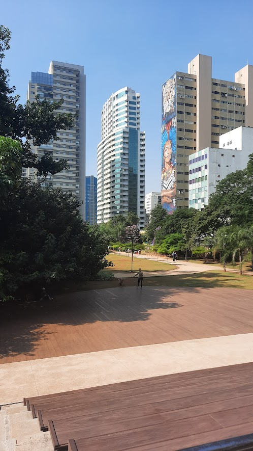
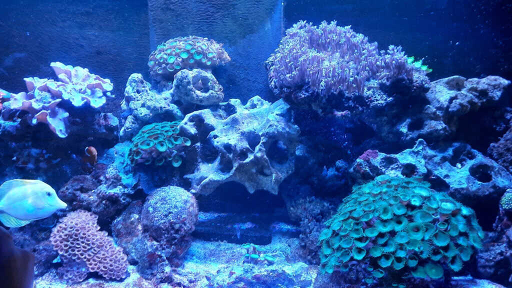
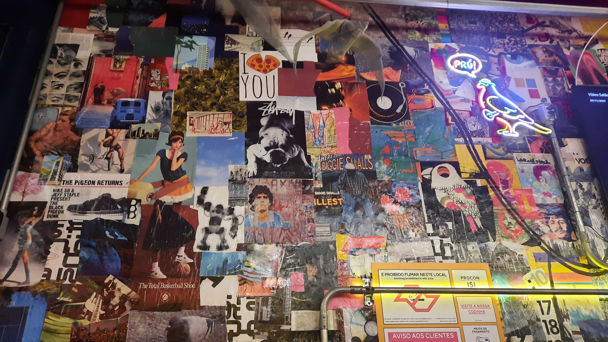
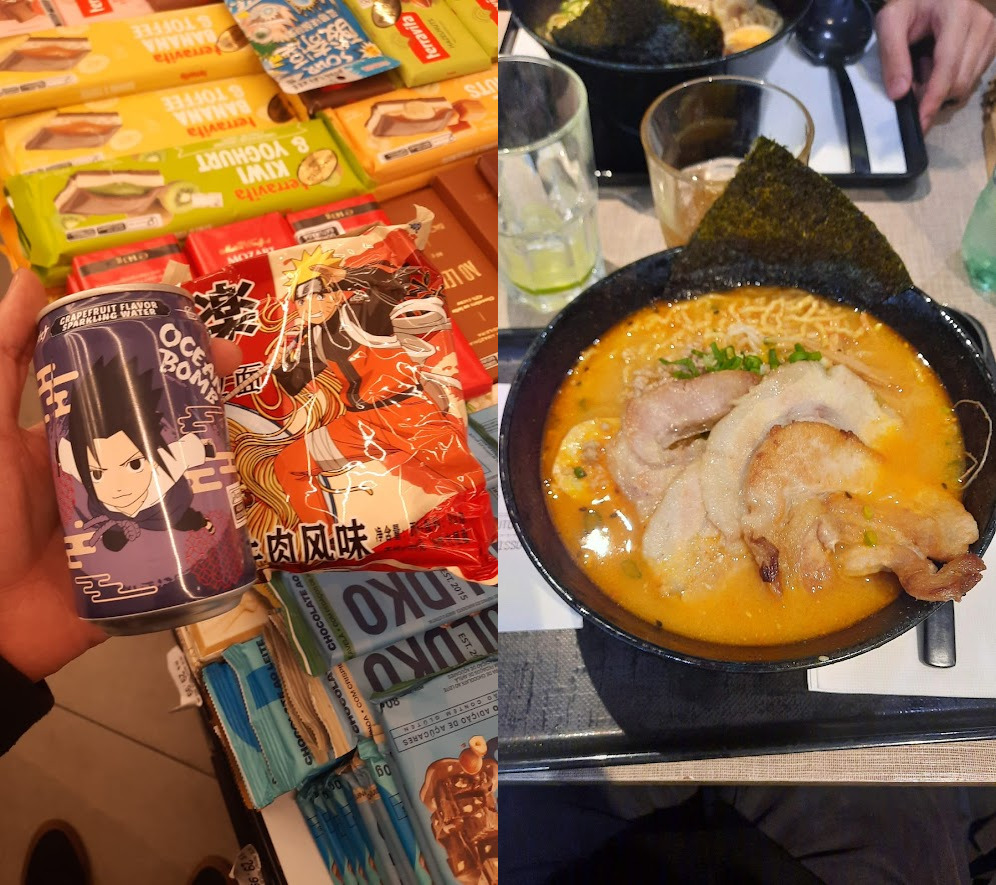
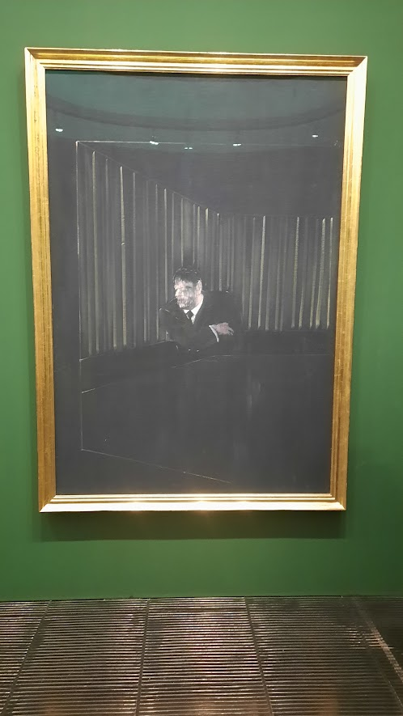
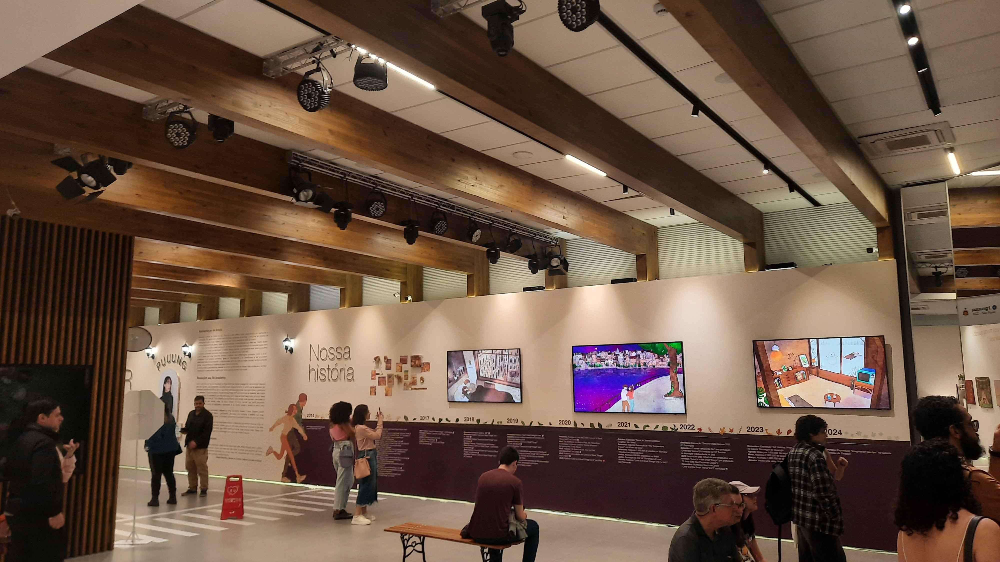
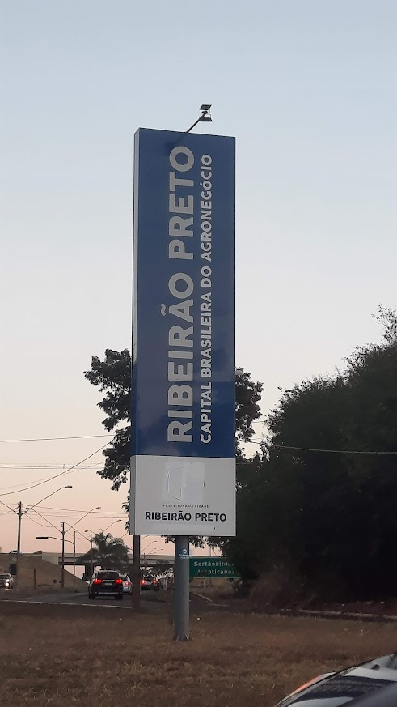
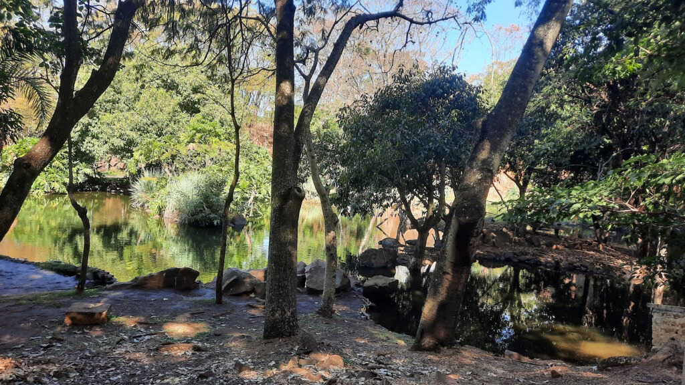

+++
title = "Viagem São Paulo/Ribeirão Preto"
slug = "viagem-sao-paulo-ribeirao-preto"
date = 2024-07-28

[taxonomies]
tags=["viagem"]
+++

Minha primeira viagem sozinho foi para São Paulo e Ribeirão Preto, onde encontrei alguns amigos da internet. Estava bastante ansioso, mas fico feliz por ter feito essa viagem e sou grato a todos que tornaram esse momento especial.

<!-- more -->

## São Paulo

Sempre tive para mim que São Paulo era um local bem confuso e hostil, mas andar por lá, sozinho ou em grupo, não foi uma experiência terrível. Fiquei hospedado num Airbnb em *Bela Vista* e pude conhecer bastante da cidade.

Achei um pouco complicado usar o app TOPsp para usar o metrô e ônibus, mas a versão de WhatsApp facilitou bastante minha vida.

Não achei os preços ruins para comer, encontramos locais com preço bem razoável e bastava andar o suficiente para encontrar o que procurávamos, seja comida, produtos, eventos...

A Avenida Paulista me pareceu um tanto superestimada e o Parque Augusta é um oásis no meio de todo o caos, apesar da estranheza de ver alguns com roupa de banho tomando sol, o cheiro de maconha e ter que aturar os péssimos mantras tocando como música ambiente, é ótimo para relaxar.

Queríamos visitar o Aquário de São Paulo e o Parque Ipiranga, então fomos de metrô até o *Ipiranga*. No começo, ficamos um pouco perdidos com a quantidade de linhas, mas depois tudo ficou tranquilo. O bairro tem um clima bem diferente da Bela Vista e da Liberdade, parecendo mais residencial e confortável para se morar.

Apesar de estar bastante lotado, o Aquário de São Paulo foi muito legal, com um preço razoável para a quantidade de animais que você pode ver lá dentro. Infelizmente, não consegui ver as lontras 🦦, mas fiquei impressionado com a variedade e os detalhes nas explicações.

Dá para passar o dia no Parque Ipiranga; não conseguimos ver metade do que havia por lá. Apenas encontramos uma sombra e descansamos até o fim da tarde. É um ótimo lugar para ficar tranquilo.

À noite, após alguns problemas para encontrar um lugar para comer que não fosse delivery, encontramos a Elettrica. Fomos bem servidos e aproveitamos para comemorar o aniversário de um amigo por lá.

> *Não lembro que peixes/corais são esses, mas são bem bonitos.*

> *Parque Ipiranga.*

> *Elettrica pizzaria na Rua Gaivota.*

Andamos bastante pela Liberdade; todas as lojas estavam bem lotadas e a maioria com placas de "Precisa-se de funcionário" ou "Estamos contratando". Lá, experimentei um "power pop" com um cachorro-quente de yakisoba e comi um lamen no Momo Lamen, que foi sem dúvida uma das melhores refeições em SP, além de algumas besteiras que comprei por lá.

> *Lamem do Naruto, bebida gaseficada de uva do Sasuke e um Lamem do Momo Lamem.*

No MASP, a segurança para entrar é rigorosa, mas a experiência ao sair foi terrível: nossa mochila foi perdida no guarda-volumes e passamos por um interrogatório apenas para recuperar dois casacos. Foi onde me senti mais maltratado pelos funcionários. (Infelizmente, deixei o selo do MASP colado na parede do Airbnb. 😢)

No entanto, fiquei impressionado com a exposição de Francis Bacon. Suas obras, bem figurativas, têm uma expressão vívida e visceral da ambiguidade entre desejo e violência. Uma em particular, "Man in Blue I", de 1954, me impressionou bastante, com um toque de solidão e distância bem interessante.

> *Man in Blue I - 1954 - Oil on canvas - 197 x 135 cm.*

À noite, visitamos o CCCB e foi uma experiência bastante aconchegante, com obras da artista Puuung em exposição. Eu conhecia apenas alguns vídeos dela no YouTube, mas foi ótimo aprender mais sobre a artista. A exposição celebrava o amor para o Dia dos Namorados. (Queria ter levado alguém especial.)

> *Exposição da artista sul-coreana Puuung no Centro Cultural Coreano no Brasil.*

Fiquei 6 dias em São Paulo, de 15/07 até 21/07.

## Ribeirão Preto

Em Ribeirão Preto, fui acolhido na casa de um amigo. A cidade, apelidada de "Califórnia brasileira", é conhecida por sua elite agrária e rápido desenvolvimento. O clima estava bastante seco, com dias quentes e noites frias. A segurança do município foi reconfortante, e me senti muito bem acolhido pelos meus amigos, que foram muito gentis comigo.

<!-- [bem-vindo-rp] -->

> *Eu achava que estava escrito "Bem Vindo a Ribeirão Preto" até ver a foto.*

Foi uma experiência bem agradável, com programas leves e super tranquilos. Fizemos um piquenique no Parque Curupira, visitei uma cafeteria interessante, alguns shoppings, vi ["Hachiko (2023)"](https://letterboxd.com/gxbe/film/hachiko-2023) no Shopping Santa Úrsula, e fui à procura de um cabo SATA no centro da cidade com um amigo. Como Ribeirão Preto não é muito acessível a pé, acabei dependendo de caronas de amigos, mas gostei bastante das caronas (Obrigado Gui e Laura! 🫂).

> *Parque Curupira. Ótimo lugar para  se fazer  um picnic.*

Fiquei 4 dias em Ribeirão Preto, de 21/07 até 24/07. Foram ótimos dias. :)

## Rio de Janeiro

A viagem de volta ao Rio de Janeiro foi tranquila, apesar das 11-12 horas de duração. Cheguei por volta das 11 horas na Urca e precisei pegar metrô e BRT para chegar em casa. Durante o trajeto no metrô, alguns jovens estavam dançando e rimando no improviso. Ao meu lado, um cara um tanto chato começou a discutir sobre política, mas felizmente consegui desviar do assunto. O BRT foi bem tranquilo e finalmente cheguei em casa depois de alguns dias fora.

Apesar dos pesares, foi uma ótima viagem. 😊

A viagem durou 10 dias, de 15/07 até 25/07.
